<table>
<colgroup>
<col style="width: 21%" />
<col style="width: 78%" />
</colgroup>
<tbody>
<tr>
<td rowspan="2"></td>
<td style="font-size: 24px;text-align: center;">
<strong>Manuel utilisateur du plugin
« IGN Contribution directe BDUni (ROUTE) »</strong>

</td>
</tr>
<tr>
<td style="font-size: 16px;text-align: center;">Développeur  : Gérôme PECHEUR (IGN)</td>
</tr>
</tbody>
</table>

                        

## Sommaire

- [1 - Prérequis](#prerequis)

- [2 - Résumé](#resume)

- [3 - Installation](#installation)

- [4 - Présentation](#presentation)

- [5 - Mode de sélection](#mode-de-selection)

    - [5.1 - Sélection unique](#selection-unique)

    - [5.2 - Sélection multiple](#selection-multiple)

- [6 - Modification](#modification)

- [7 - Extra](#extra)

    - [7.1 - A propos](#a-propos)

  <h2 id="prerequis" style="color: white;margin:0;" >1. Prérequis</h2>

Version de QGIS : 3.28 ou supérieur.  
Y compris QGIS4

Le plugin « maitre » doit préalablement être installé : 
[maitre-qgis-plugin sur GitHub](https://github.com/IGNF/maitre-qgis-plugin)

Les fonctionnalités Afficher le sens de numérisation et Chemin le plus
court nécessitent l’installation des 2 plugins de même nom (à cocher
dans l’exécutable d’installation).

Ce plugin fonctionne uniquement avec la couche éditable des routes de la
BDTopo nommée : « troncon_de_route ».

  <h2 id="resume" style="color: white;margin:0;" >2. Résumé</h2>

Ce plugin est une aide à la modification des attributs des tronçons de
routes de la BDTopo en y intégrant des contrôles sémantiques pour tout
changements.

  <h2 id="installation" style="color: white;margin:0;" >3. Installation</h2>

Le plugin s’installe en lançant l’exécutable d’installation et en
cochant le plugin route.

Installer les plugins Chemin le plus court et Sens de numérisation pour
avoir accès à ces fonctionnalités.

  <h2 id="presentation" style="color: white;margin:0;" >4. Présentation</h2>

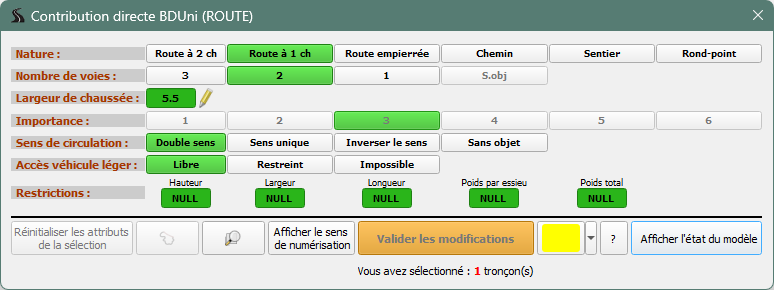

Cette interface permet de modifier certains attributs des tronçons de
routes

Le bouton « **?** » permet d’afficher le suivi des versions et d’ouvrir
la documentation du plugin.

Le bouton « **Réinitialiser les attributs de la sélection** » permet
d’annuler les modifications en cours.

Le bouton 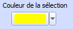 Permet de modifier la
couleur des tronçons sélectionnés dans QGIS. Ça peut être utile suivant
la symbologie appliquées pour les tronçons dans QGIS.

Le bouton 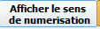 permet de visualiser le sens
de numérisation des tronçons de route pour faciliter le choix du Sens de
circulation.

Le bouton 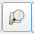 recentre l’écran sur les
tronçons sélectionnés.

Le bouton  sélectionne tous les
tronçons de route entre les 2 tronçons sélectionnés en respectant
l’itinéraire le plus court entre les 2.

Le bouton « **Valider les modifications** » valide les choix et
enregistre les modifications dans la couche.

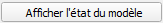

A l’ouverture de l’outil il y a une vérification de la présence dans le
projet des couches nécessaires. Afficher l’état du modèle permet de
**vérifier les permissions sur chaque attribut**. Ces permissions sont
définies dans le projet en fonction des guichets en saisie directe dans
la BDTOPO.

<figure>
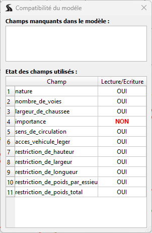
</figure>

  <h2 id="mode-de-selection" style="color: white;margin:0;" >5. Mode de sélection</h2>

  <h2 id="selection-unique" style="color: white;margin:0;" >5.1 Sélection unique</h2>

- Sélection unique, on ne sélectionne qu’un seul tronçon avec l’outil de
  sélection de QGIS

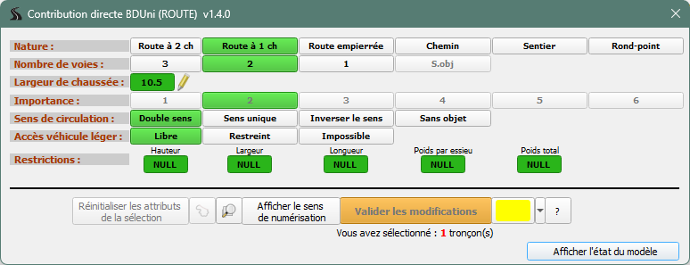

Les valeurs des attributs du tronçon sélectionné s’affichent en vert
dans l’interface.

  <h2 id="selection-multiple" style="color: white;margin:0;" >5.2. Sélection multiple</h2>

- Sélection multiple avec l’outil de saisie. Dans QGIS on peut
  sélectionner manuellement un ensemble de tronçons

- Sélection multiple de tronçons contigües, on sélectionne 2 tronçons
  (le premier et le dernier). Ces 2 tronçons doivent être visibles à
  l’écran et être connectés. Ensuite on clique sur
  , le résultat est une
  sélection de tous les tronçons entre le premier et le deuxième
  sélectionnés respectant l’algorithme du chemin le plus court. Un
  contrôle visuel est toutefois nécessaire afin de vérifier si la
  sélection faite est celle attendue.

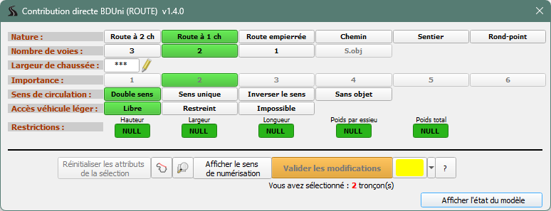

Seuls les attributs communs à tous les tronçons sont représentés en
vert.

  <h2 id="modification" style="color: white;margin:0;" >6. Modification</h2>

Une fois les tronçons sélectionnés il suffit de cliquer sur les
nouvelles valeurs choisies.

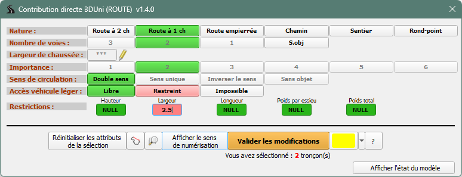

**Les valeurs non autorisées apparaissent en grisé** et ne sont pas
sélectionnables.

**Les valeurs modifiées sont affichées sur un fond rose** mais ne sont
pas encore validées.

Si on modifie la nature, l’outil propose des valeurs compatibles avec la
nouvelle nature pour les autres attributs.

Les modifications sur le(s) tronçon(s) sélectionné(s) sont à valider
avec le bouton 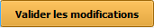

Un message QGIS confirme la prise en compte des modifications.

  <h2 id="extra" style="color: white;margin:0;" >7. Extra</h2>

  <h2 id="a_propos" style="color: white;margin:0;" >7.1. A propos</h2>

Accessible via .

Cette boite permet de suivre l’historique des différentes versions ainsi
que d’afficher cette documentation.

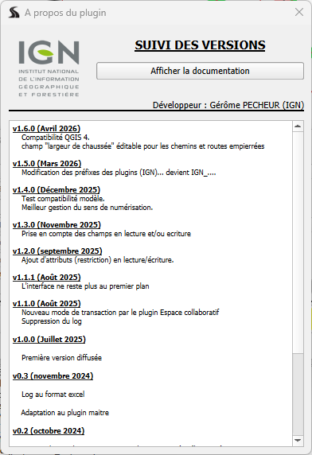
